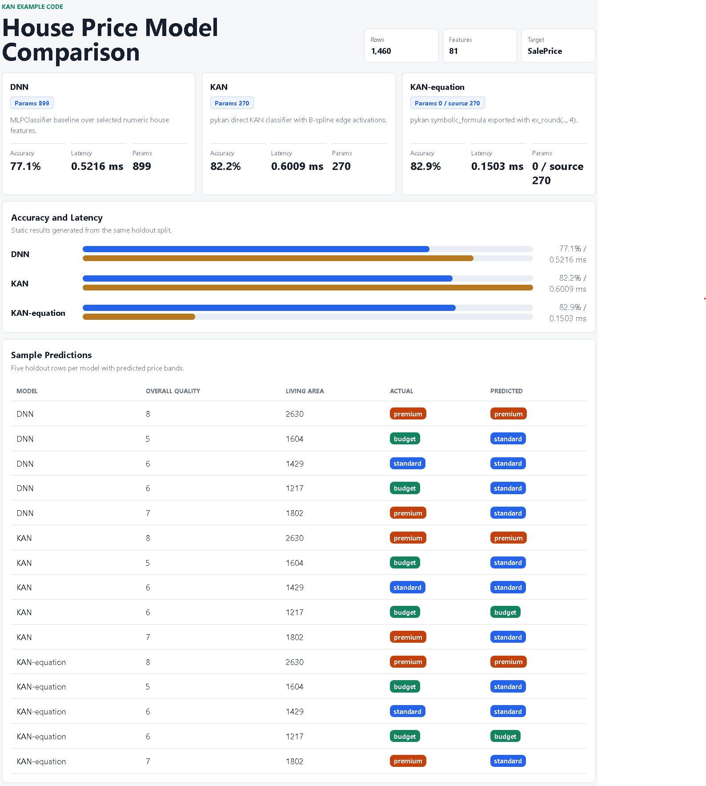

# Kan

Example code for comparing an MLP/DNN baseline, a pykan direct KAN classifier
with B-spline edge activations, and a decoded KAN-equation classifier on the
OpenML `house_prices` dataset.

The source dataset is regression-oriented (`SalePrice`). This project turns it
into a classification task by deriving three price bands from the training split:
`budget`, `standard`, and `premium`.

## Run Locally

```bash
pip install -r requirements.txt
python codes/run_all.py
pytest
```

Generated comparison results are written to `docs/result/` and mirrored to
`codes/web-showcase/comparison.json`.

## Latest Results

The latest generated comparison uses 1,168 train rows and 292 holdout rows.
The static showcase at `http://localhost:8080` shows these same values on the
top model cards.

| Model | Runtime | Params | Accuracy | Latency |
| --- | --- | ---: | ---: | ---: |
| DNN | sklearn `MLPClassifier`, hidden layers `(32, 16)` | 899 | 0.7705 | 0.5216 ms |
| KAN | pykan direct `[9, 3]`, `grid=2`, `k=2` | 270 | 0.8219 | 0.6009 ms |
| KAN-equation | rounded pykan `symbolic_formula()` export | 0 runtime / 270 source | 0.8288 | 0.1503 ms |

KAN has about 70% fewer trainable parameters than the DNN baseline in this run.
KAN-equation has no learned runtime tensors after export, so its runtime
parameter count is `0`; the dashboard also shows the source KAN parameter count
as `source 270`.

## API Services

```bash
python codes/original/classify/app.py      # DNN on :8001
python codes/kan/classify/app.py           # KAN on :8002
python codes/kan-decode/classify/app.py    # KAN-equation on :8003
```

Each service exposes:

- `GET /health`
- `POST /predict` with either one JSON sample or `{ "samples": [...] }`

## Docker

```bash
docker compose up --build
```

Services:

- DNN API: `http://localhost:8001`
- KAN API: `http://localhost:8002`
- KAN-equation API: `http://localhost:8003`
- Static showcase with accuracy, latency, and params: `http://localhost:8080`

## Final KAN-Equation

The current KAN-equation is exported from the optimized direct KAN:

```text
KAN width = [9, 3]
grid = 2
k = 2
KAN trainable params = 270
```

It was generated from pykan with symbolic fitting and rounded coefficients:

```python
ex_round(model.symbolic_formula()[0][class_index], 4)
```

Input features are first min/max scaled to `[-1, 1]` using the KAN training
artifact:

```text
x1 = scaled OverallQual
x2 = scaled GrLivArea
x3 = scaled GarageCars
x4 = scaled TotalBsmtSF
x5 = scaled YearBuilt
x6 = scaled FullBath
x7 = scaled LotArea
x8 = scaled 1stFlrSF
x9 = scaled 2ndFlrSF
```

Measured after symbolic export:

- Accuracy: `0.8288`
- Latency: `0.1503 ms` for 5 scaled rows
- Runtime params: `0` (`270` params in the source KAN)
- Formula characters: `932`
- Symbolic operations: `138`
- Common-subexpression terms from SymPy `cse`: `0`

The formula is already compact after reducing KAN to a direct `[9, 3]` topology,
so SymPy/Sage-style algebraic simplification has little to merge.

```python
from math import sin, sqrt, tanh


def kan_equation_from_scaled(x):
    x1, x2, x3, x4, x5, x6, x7, x8, x9 = x
    budget_logit = 11.1128*sqrt(7.7658 - 0.8148*x5) - 2.386*sqrt(2.6281*x9 + 5.6582) - 1.1448*sin(1.5494*x3 + 6.6062) - 2.2276*sin(1.2652*x4 + 7.1754) - 0.1379*sin(1.1985*x6 + 5.4008) + 1.9521*sin(1.4994*x7 - 2.4025) - 4.036*sin(0.8262*x8 + 0.9804) - 3.5166*tanh(1.4695*x1 + 0.0431) - 5.1189*tanh(0.9195*x2 + 1.2125) - 20.2868
    standard_logit = -0.0112*(0.2 - 10.0*x1)**2 + 0.6613*sin(3.147*x2 - 9.0248) + 0.6981*sin(1.5291*x3 - 5.1787) - 0.2407*sin(3.9954*x4 - 6.0117) + 0.3237*sin(2.1199*x5 + 0.0477) - 2.9676*sin(4.6646*x6 + 7.8306) + 0.5791*sin(1.6818*x7 - 9.5494) + 0.1569*sin(2.8128*x8 + 9.7947) + 0.4866*sin(2.4264*x9 - 2.9677) - 1.5919
    premium_logit = -2.5295*sqrt(7.3971 - 4.32*x5) + 2.13*sin(1.798*x2 + 0.8042) - 1.1939*sin(1.2874*x3 - 9.3682) + 2.5127*sin(1.5986*x4 + 7.0046) + 2.0872*sin(1.2778*x8 + 0.9907) + 1.2899*sin(1.9247*x9 + 0.3605) + 3.2334*tanh(1.6251*x1 - 0.1526) + 0.1768*tanh(2.284*x6 - 0.5581) - 0.4178*abs(7.0712*x7 - 5.045) + 8.8365
    logits = {"budget": budget_logit, "standard": standard_logit, "premium": premium_logit}
    return max(logits, key=logits.get), logits
```


